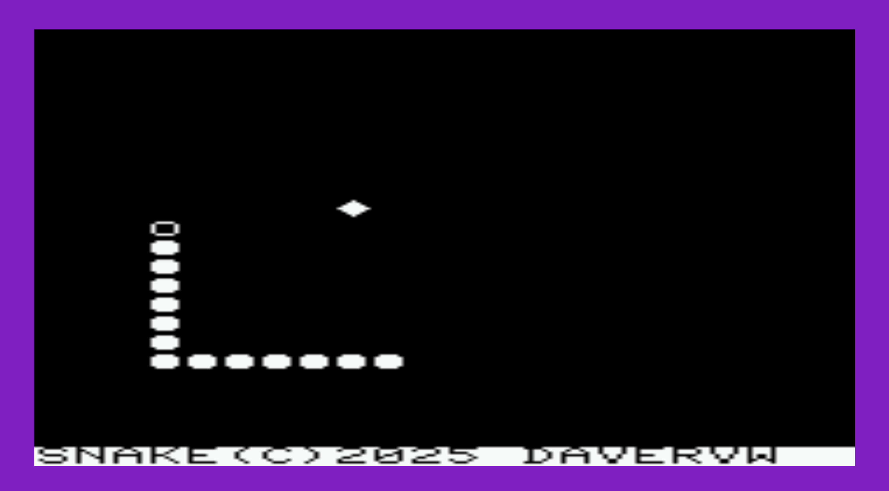

# Snake for Commodore #

This is the classic snake game currently written to target Commodore Vic-20 (plan to update to support more targets)

Programmed in Commodore BASIC, pokes(peeks) to(from) screen/color memory

PRG and D64 files are included

MIT License

Instructions:

* Use Z to turn left from perspective of snake
* Use / to turn right from perspective of snake
* Can also use cursor keys, but have to use with SHIFT to turn left
* Joystick also supported, point direction you want the snake to go
* Use STOP+RESTORE to exit and restore proper keyboard use

